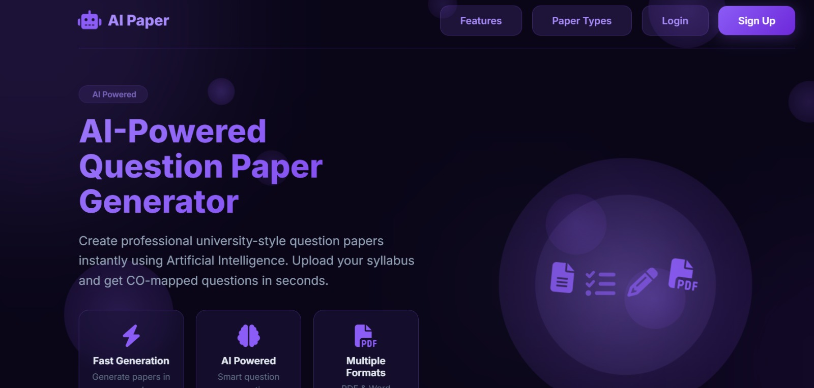
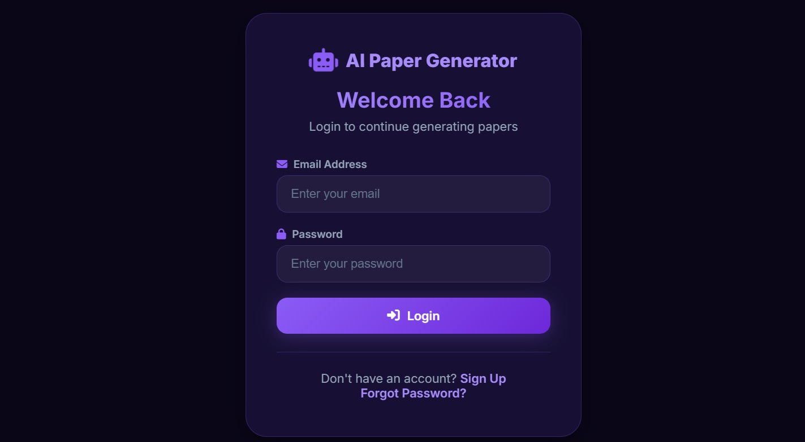
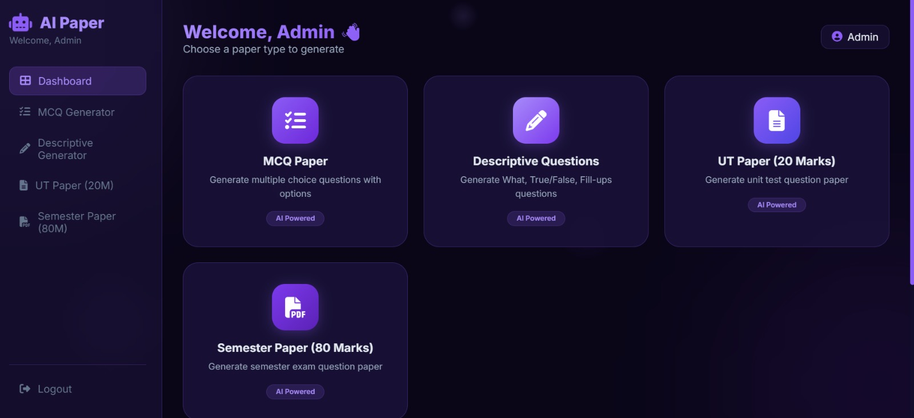
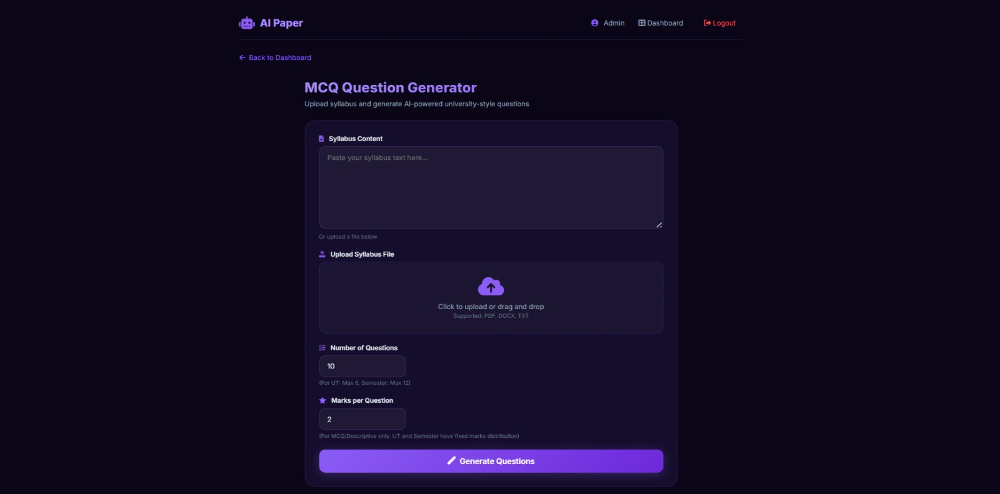

\# 🤖 Automatic Question Paper Generator


An AI-powered question paper generator for universities and colleges. Generate MCQ, Descriptive, UT, and Semester papers with Course Outcome mapping.


\## ✨ Features


\- 🤖 \*\*AI-Powered Generation\*\* - OpenAI/OpenRouter integration

\- 📝 \*\*4 Paper Types\*\* - MCQ, Descriptive, UT (20M), Semester (80M)

\- 🎯 \*\*CO Mapping\*\* - Each question mapped to Course Outcomes (CO1-CO6)

\- 📥 \*\*Multiple Formats\*\* - Download as PDF or DOCX

\- 🎨 \*\*Modern UI\*\* - Dark purple theme with animations

\- 🔐 \*\*User Authentication\*\* - Login/Signup system

\- 📤 \*\*File Upload\*\* - Upload syllabus in PDF, DOCX, TXT


\## 🚀 Tech Stack


\- \*\*Backend:\*\* Flask (Python)

\- \*\*AI:\*\* OpenAI API / OpenRouter API

\- \*\*Database:\*\* Firebase (optional) / In-memory storage

\- \*\*Frontend:\*\* HTML, CSS, JavaScript

\- \*\*PDF Generation:\*\* ReportLab

\- \*\*DOCX Generation:\*\* python-docx


\## 📋 Prerequisites


\- Python 3.8+

\- pip


\## 🔧 Installation


```bash

\# Clone repository

git clone https://github.com/YOUR\_USERNAME/automatic-question-paper-generator.git

cd automatic-question-paper-generator


\# Create virtual environment

python -m venv venv

source venv/bin/activate  # Linux/Mac

\# or

venv\\Scripts\\activate  # Windows


\# Install dependencies

pip install -r requirements.txt


\# Create .env file

cp .env.example .env

\# Add your API keys in .env


\# Run the application

python app.py

# Screenshots

## Index Page


## Login Page



## Home Page


## Dashboard



## Question Generator



## Paper 

